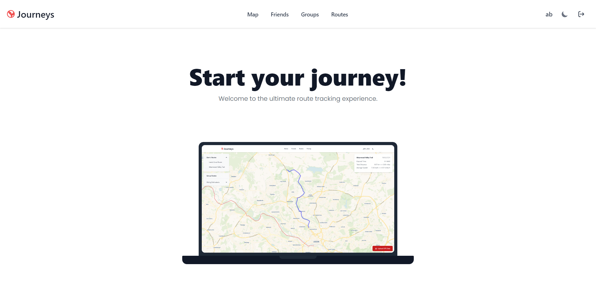
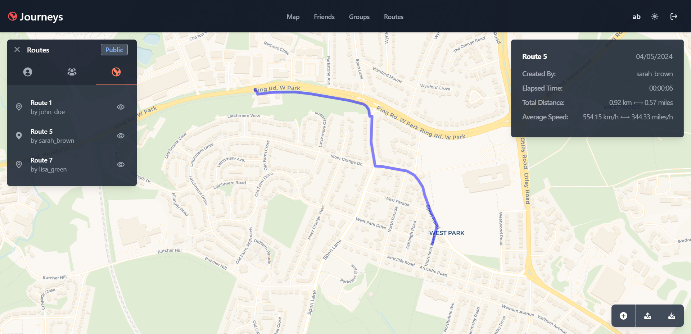
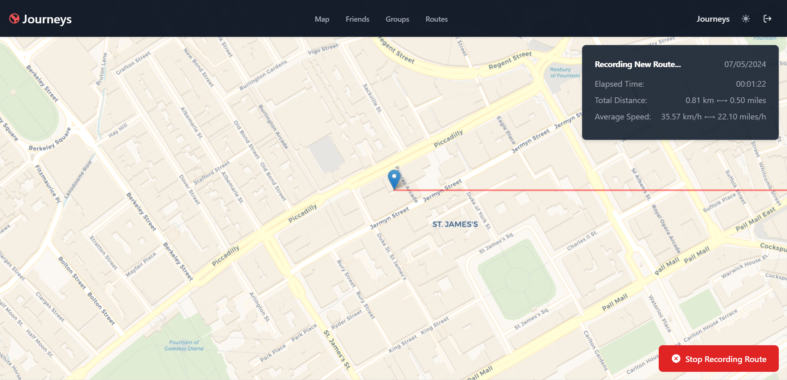
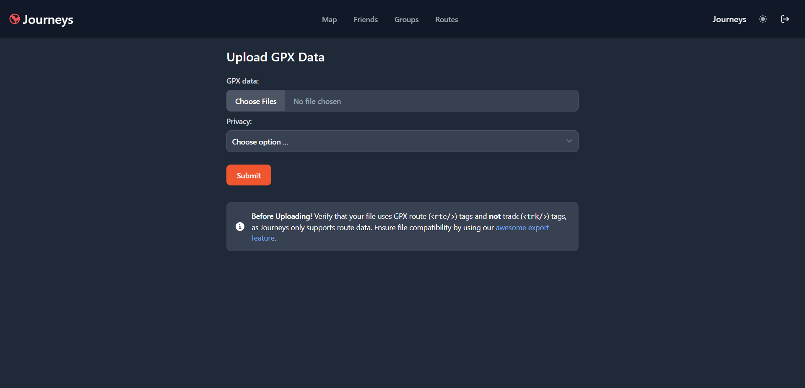
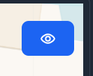
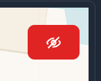

<div align="center">
<h1>🌎 Journeys</h1>

The ultimate route tracking experience.
</div>

Journeys is a feature-rich route tracking program developed for Uni of Leeds' COMP2913 module. It records walks submitted by its users and visualises them on its intuitive and accessible interface. Customers can use its social features to share their progress with friends, or opt to publish selected routes to the groups they moderate. The app uses a premium business model and charges users for their subscriptions. Using the app requires a payment of £1.50 per week, £5.00 per month, or £45.00 per year.

* **Track Your Activities -**
    Record your runs, rides, and workouts with live GPS tracking. Supports GPX file uploading and downloading to synchronize your data with other third party applications.

* **Socialise -**
    Connect with friends and share your fitness journey with them. Use Journeys to view each others routes and keep yourselves motivated.

* **Collaborate -**
    Create groups and share your routes with other members. View the repository of public routes to get inspiration for new walks and to see others' progress.


| Landing Page (Light Mode)     | Map Page (Dark Mode)      |
| ----------------------------- | ------------------------- |
|  |  |


## How to Use

### Account Setup
To register an account with Journeys, follow the link in the navbar or navigate to `/login`. Users are required to provide the following information to create an account:
* First and last name
* Username
* Email address
* Password

Upon creating an account, the user will be prompted to select their payment plan. The app uses a premium business model and charges users for their subscriptions. Using the app requires a payment of £1.50 per week, £5.00 per month, or £45.00 per year. The user can attempt to navigate the app without paying, however most features will simply redirect to the payments prompt as they are not free to use.


### Adding a Route

New routes can be recorded by navigating to either `/record` or `/upload`.

#### Recording a new route
New routes can be recorded in real time using `/record`. After the user begins recording, they can walk around with their mobile device and their location updates will be stored in the database. They should stop the recording once they arrive at their destination, and give their route a new name when prompted.

#### Uploading routes from a GPX file
Alternatively, routes can be appended to the database via `/upload`. The form offers users a way to upload GPX files stored on their local devices to add routes to their account. This is the fastest way to upload routes in bulk and serves as an efficient method of transferring routes from one user's account to another. Note that all uploaded files **must** make use of GPX's `<rte>` tags and not `<trk>` tags, as Journeys only parses the routes provided this way.

| Recording a Route                     | Uploading Routes                     |
| ------------------------------------- | ------------------------------------ |
|  |  |


### Accessing Routes

#### The Map
The map displays all currently selected routes on an interactive interface that allows the user to pan around and see information about them. This page is capable of displaying selected user routes, friend routes, public routes, and group routes. Routes can be selected by either clicking them on the map or selecting them in the side menu. Once selected, a menu will appear on the right describing the following information about the chosen route:
* The route's name
* The route's creator
* The elapsed time
* The distance travelled
* The average speed
* The route's distance from user's current position (if geolocation is enabled in the user's browser)

In the bottom corners, there are buttons that allow the user to record new routes, upload their data, download their data, and snap to their current location on the map. The user's current location is marked with a blue pin on the map.

| The Map (`/map`)    |
| -------------------- |
|  |

#### Routes Selection Page
In order to view routes on the map, they must first be marked as visible within the routes selection page (`/routes`). This page will display all routes that the user has permission to see. This includes their own routes, their friends' routes, group routes, and public routes. The eye icon signifies a visibility toggle...

| Shown Route                      | Hidden Route                          |
| -------------------------------- | ------------------------------------- |
|  |  |

Routes marked as visible will appear the next time the user visits the map. The pencil icon in the top left of each route allows the user to edit metadata such as the route's name, completion time, and privacy.


### Social Features

#### Adding Friends
By navigating to `/friends`, the user can add and remove other users from their friends list. New friends are sent requests that they must accept before both users are able to see each others routes. The search bars can be used to find other accounts and filter through friend requests. Friends can also be removed from this screen.

#### Joining Groups
The `/groups` page gives members a way to join and create groups to which they can publish routes and share their progress. To join a group, use the search bar at the top of the page to find the group you are looking for and press the 'join' button. This will send a join request to admins of the group, who can then decide to accept or decline the user's membership. The '+' button in the top right of the page offers users a way to create their own groups, which they can then invite their friends (and other users) to.


## Authors
* [Abbie Hewitt](https://github.com/archivehaze)
* [Ayomide Soruna](https://github.com/AyoSoruna)
* [Connor Boucher](https://github.com/cbouch-uni)
* [Dylan Dickinson](https://github.com/DylanDD12)
* [Hari Chander](https://github.com/HariC02)
* [Kaitlyn Chan](https://github.com/sc22kc2)


## Requirements
* node-js >= v18.13
* npm
* docker (optional)


## Deployment

To simplify deployment, we have created a single command to prepare and run a live production server:
```bash
npm run deploy
```

If you would like to create a production version of the app without hosting a web server, use `npm run build` and the software will be compiled into the `/build` directory. Remember to run `npm install` first to pull and install and remote dependencies. You can preview this production build using `npm run preview`.


### Using Docker

To generate a Docker image file, run:
```bash
docker build --tag journeys .
```
and run a container using your preferred Docker client. We recommend Docker Desktop for its first party support.


## Development

Once you've cloned the project and installed dependencies with `npm install` (or `pnpm install` or `yarn`), start a development server:

```bash
npm run dev

# or start the server and open the app in a new browser tab
npm run dev -- --open
```


## Documentation
See [repo wiki](https://github.com/uol-feps-soc-comp2913-2324s2-classroom/team-project-team-12/wiki)
